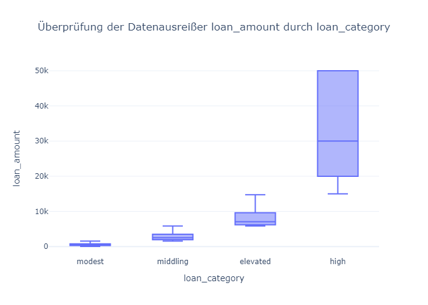
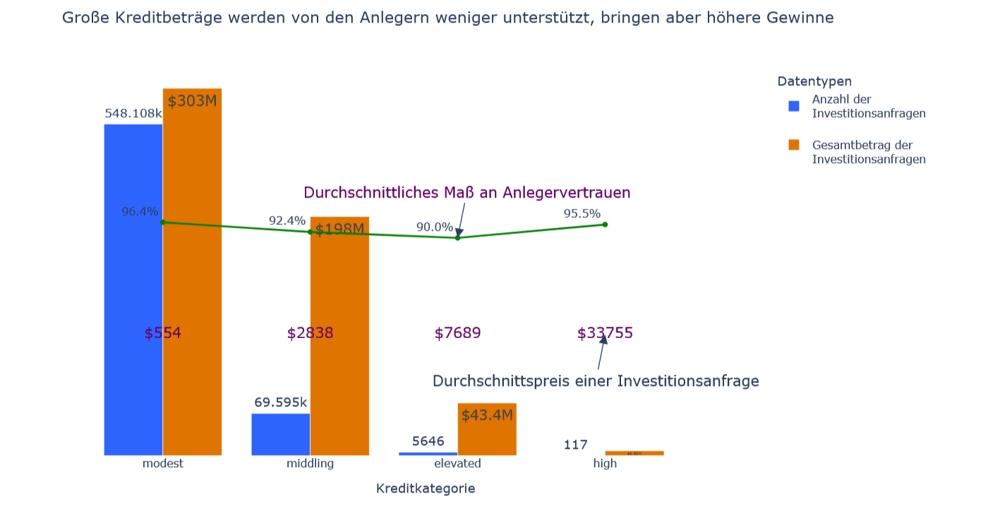

---

# Kiva Loan Data Analysis

### Unlocking Insights in Microfinance with Data Science

Welcome to the **Kiva Loan Data Analysis** project, a comprehensive exploration of microfinance data from Kiva.org. This repository offers a complete pipeline for preparing and analyzing loan data, transforming raw datasets into actionable insights through state-of-the-art methods and compelling visualizations.

---

## Project Overview

This project is divided into two main components:

1. **Data Preparation**:  
   Innovative data cleaning, stratification, and feature engineering processes ensure the dataset is analysis-ready. Techniques include:
   - Filling missing values intelligently.
   - Stratifying data for balanced machine learning models.
   - Creating derived features to enrich the dataset.

2. **Exploratory Data Analysis**:  
   Visual storytelling and statistical analysis are used to uncover trends and patterns in Kiva loans. Highlights include:
   - Interactive dashboards built with Plotly.
   - Static and dynamic visualizations using Seaborn and Matplotlib.
   - Detailed analysis of loan distributions, repayment patterns, and demographic insights.

---

## Repository Structure

```
/Kiva-Loan-Analysis
├── Data-Preparation
│   ├── Kiva_Analysis_01_DM.ipynb    # Data preparation notebook
│   ├── README.md                    # Description of the preparation phase
│   └── requirements.txt             # Dependencies for preparation
├── Visualization
│   ├── Kiva_Analysis_02_EDA.ipynb   # Visualization and analysis notebook
│   ├── README.md                    # Description of the visualization phase
│   └── requirements.txt             # Dependencies for visualization
├── LICENSE                          # License details
└── README.md                        # Main project description
```

---

## Key Features

### 🛠 Data Preparation
- Advanced cleaning methods to handle missing and inconsistent data.
- Stratification of data for improved analytical accuracy.
- Feature engineering for richer insights.


### 📊 Data Visualization
- Interactive dashboards for deep dives into data patterns.
- Geospatial and temporal visualizations for global insights.
- Statistical comparisons across demographics and loan categories.


---

## Tools and Technologies

- **Programming**: Python  
- **Libraries**: Pandas, Matplotlib, Seaborn, Plotly, Scikit-learn  
- **Environment**: Jupyter Notebooks  
- **Data Source**: [Kaggle Dataset - Kiva Loans](https://www.kaggle.com/datasets/kiva/data-science-for-good-kiva-crowdfunding)

---

## Getting Started

1. Clone the repository:
   ```bash
   git clone git@github.com:whellcome/KivaLoanDataAnalysis.git
   cd KivaLoanDataAnalysis
   ```

2. Install dependencies:
   - For data preparation:
     ```bash
     pip install -r Data-Preparation/requirements.txt
     ```
   - For visualization:
     ```bash
     pip install -r Visualization/requirements.txt
     ```

3. Open the notebooks:
   ```bash
   jupyter notebook
   ```

4. Run:
   - Data Preparation: `Data-Preparation/Kiva_Analysis_01_DM.ipynb`
   - Visualization: `Visualization/Kiva_Analysis_02_EDA.ipynb`

---

## Future Improvements

- Automate data cleaning and visualization pipelines.
- Expand analysis with external datasets.
- Integrate machine learning models for predictive insights.
- Create a web app for real-time data exploration.

---

## Contributing

Contributions are welcome! Please fork the repository, make your changes, and submit a pull request.  

---

## Support

If you find this project insightful, consider supporting it by [buying me a coffee](https://www.buymeacoffee.com/whellcome).  

---

**Kiva Loan Data Analysis**  
Empowering microfinance through data.

---
