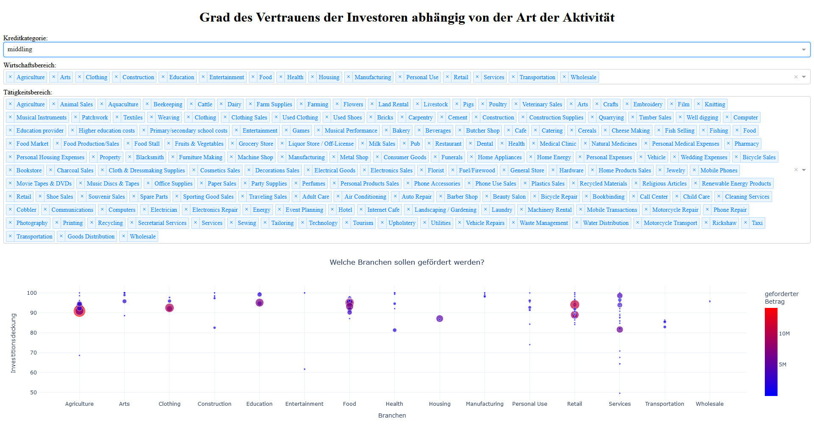

---

# Kiva Loans Data Exploration and Visualization

## Overview

This project presents a **comprehensive data exploration and interactive visualization web application** for analyzing loan statistics on the Kiva platform. It leverages cutting-edge tools like **Dash**, **Plotly**, and **Pandas** to visualize and analyze data trends in global microfinance. 

The application provides insights into loan distributions across countries, categories, and sectors, highlighting key trends and fostering data-driven decision-making.

---

## Key Features

### Interactive Web Application
Developed using **Dash**, the application enables users to:
- Visualize loan distributions by country using **choropleth maps** and **scatter plots**.
- Explore loan statistics by categories, sectors, and activities through **bar charts**, **line graphs**, and **scatter plots**.
- Interactively analyze investor confidence levels based on selected filters.

### Data Preparation and Aggregation
- Cleaned and structured data from the Kiva Loans dataset using **Pandas**.
- Aggregated data to highlight country-wise and sector-wise trends.
- Implemented efficient data manipulation techniques for real-time interaction.

### Innovative Features
- **Custom Loan Group Insights**: Analysis of investor trust levels in different categories.
- **Dynamic Filters**: Sector and activity-level analysis with real-time updates.
- **Future Potential**: Integration of text analysis to evaluate popular loan uses and cross-referencing with socio-economic indicators such as GDP.

---

## Visualizations and Insights
### Geographic Analysis
- **Loan Distribution by Country**: Choropleth maps display total loan sums and counts by country.
- **Loan Hotspots**: Scatter plots highlight investment density across regions.

### Sector and Category Analysis
- **Loan Trends by Categories**: Bar charts and line graphs provide insights into loan amounts and investor confidence.
- **Sector-Activity Interplay**: Scatter plots showcase relationships between sectors, activities, and funded ratings.

### Sample Screenshot


---

## Technologies Used
- **Dash**: For creating interactive web applications.
- **Plotly**: For creating advanced visualizations.
- **Pandas**: For data cleaning, aggregation, and manipulation.
- **Jupyter Notebook**: For prototyping and development.

---

## Future Enhancements
1. **Investor Group Recommendations**:
   - Analyze average investments and recommend suitable groups to investors.
2. **Text Analysis**:
   - Extract insights from the "use" column to identify trends in loan purposes and investor preferences.
3. **Gender and Economic Correlation**:
   - Explore applicant gender distributions and correlate them with country-specific GDP and population data.

---

## How to Run
1. Clone the repository:
   ```bash
   git clone git@github.com:whellcome/KivaLoanDataAnalysis.git
   cd KivaLoanDataAnalysis
   ```
2. Install dependencies:
   ```bash
   pip install -r Visualization/requirements.txt
   ```
3. Run the Dash ib the Jupyter Notebook:
   ```bash
   `Visualization/Kiva_Analysis_02_EDA.ipynb`
   ```
4. Access the application in your browser at `http://localhost:8099`.

---

## Contribute
Contributions to this project are welcome! If you have ideas to enhance its features or find any bugs, feel free to open an issue or submit a pull request.

---

## Support This Project
If you find this project valuable and would like to support its development:
[](https://www.buymeacoffee.com/whellcome)

---

